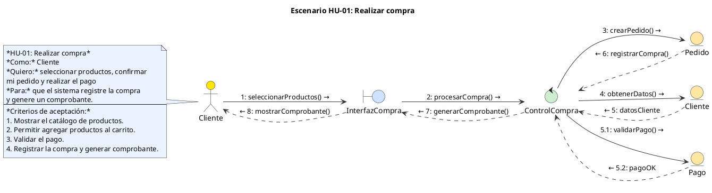

# Skill: diagramas de colaboración (etapa de análisis)

Prompt de trabajo para producir un **diagrama de colaboración (de comunicación)
UML 2.5 de la ETAPA DE ANÁLISIS** de un escenario de historia de usuario: clases
de análisis —nunca de diseño ni de implementación— y validación de las reglas de
robustez antes de entregarlo.

## Cuándo usarla

- Cuando se pida el diagrama de colaboración / análisis de una HU.
- Cuando se pida el de un escenario concreto (éxito, error, pago rechazado…):
  un archivo por escenario.

## Dónde mirar (solo como REFERENCIA de nombres)

| Fuente | Para qué |
|---|---|
| `docs/reglas-de-negocio/HU_CRITERIOS_ACEPTACION.md` | épica, prioridad, estimación y **criterios de aceptación** de cada HU |
| `docs/reglas-de-negocio/CASOS_DE_USO.md` | los CU con su flujo principal y alternativos (CU-NN ↔ HU-NN) |
| Jira (proyecto **AYD**) | estado real; es la fuente de verdad |
| `docs/reglas-de-negocio/ASIGNACIONES_SPRINTS.md` | quién desarrolla cada HU y a qué sprint pertenece |
| código (`backend/src`, `frontend/src`) | solo para reutilizar los nombres del dominio |

Entrega: `docs/reglas-de-negocio/diagramas/colaboracion/<hu-xx-nombre>.puml` (la carpeta se crea al
generar el primer diagrama; hoy el repositorio no tiene ningún `.puml`).

Estilo del proyecto: nombres en español y en lenguaje del negocio; sin conceptos
de diseño (`DTO`, `DAO`, `Repository`, `Service`, `Impl`, frameworks, tipos de
datos); los commits van sin atribución de IA.

---

## Rol

Actúa como analista de software experto en UML 2.5 y en el Proceso Unificado.
Vas a construir un Diagrama de Colaboración (Comunicación) de la ETAPA DE
ANÁLISIS para un escenario de una historia de usuario.

## Historia de usuario

ID y nombre: `<<HU-XX: Nombre>>`

Como: `<<rol>>`

Quiero: `<<acción>>`

Para: `<<beneficio>>`

Criterios de aceptación:

```
<<PEGA AQUÍ LOS CRITERIOS>>
```

## Paso 1: Identifica las clases de análisis

Lee la historia y revisa el proyecto solo como REFERENCIA para usar los mismos
nombres del dominio (entidades, módulos, acciones). Luego identifica:

- Actor: el rol del "Como".
- `<<boundary>>`: una clase de interfaz por cada pantalla o punto de contacto con
  el actor. Nombre: `Interfaz<Algo>` (ej. `InterfazCompra`).
- `<<control>>`: una clase de control que coordina el escenario.
  Nombre: `Control<Algo>` (ej. `ControlCompra`). Agrega otro `<<control>>` solo si
  el escenario coordina un subproceso distinto (ej. `ControlPago`).
- `<<entity>>`: los conceptos del negocio que se consultan o registran
  (ej. `Pedido`, `Cliente`, `Pago`).

Reglas de análisis:

- NO uses clases de diseño ni de implementación: nada de DTO, DAO, Repository,
  Service, Impl, frameworks ni tipos de datos.
- Nombres en lenguaje del negocio y en español.
- Si un concepto de la historia no existe en el código, inclúyelo igual (es
  análisis) y márcalo en la lista de supuestos.

## Paso 2: Reglas de comunicación (análisis de robustez)

Conexiones PERMITIDAS (las únicas válidas):

- Actor → `<<boundary>>`: el actor inicia la interacción. La respuesta al actor
  (ej. "8: mostrarComprobante()") viaja de vuelta por este mismo enlace.
- `<<boundary>>` ↔️ `<<control>>`
- `<<control>>` ↔️ `<<control>>`: úsalo cuando el escenario requiera coordinar
  otro caso de uso o subproceso (ej. `ControlCompra` ↔️ `ControlPago`).
- `<<control>>` ↔️ `<<entity>>`

Conexiones PROHIBIDAS (si alguna aparece, corrige el diagrama):

- Actor ↔️ `<<control>>` y Actor ↔️ `<<entity>>`
- `<<boundary>>` ↔️ `<<boundary>>`
- `<<boundary>>` ↔️ `<<entity>>`
- `<<entity>>` ↔️ `<<entity>>`

En resumen: el `<<control>>` es el único que habla con las `<<entity>>`, y el
`<<boundary>>` es el único que habla con el actor.

Formato de los mensajes:

- Número de secuencia y verbo en infinitivo: "1: seleccionarProductos()".
  Usa numeración anidada (5.1, 5.2) para los mensajes que dependen de otro.
- Las respuestas van con línea punteada: "5: datosCliente", "5.2: pagoOK".
- Cada criterio de aceptación debe quedar cubierto por al menos un mensaje.

Validación final: antes de entregar, revisa cada enlace del diagrama contra
esta tabla y reporta "Reglas de robustez: OK" o la lista de violaciones
corregidas.

## Paso 3: Entregables

1. Archivo `docs/reglas-de-negocio/diagramas/colaboracion/<hu-xx-nombre>.puml` en PlantUML,
   siguiendo EXACTAMENTE la plantilla de estilo de abajo.
2. Una tabla de trazabilidad:

   | Criterio de aceptación | Mensajes que lo cubren |
   |---|---|

3. El resultado de la validación de reglas de robustez.
4. Una lista breve de supuestos.

Si la historia tiene varios escenarios (éxito, error, pago rechazado), crea un
archivo por escenario: `<hu-xx-nombre>-exito.puml`, `<hu-xx-nombre>-error.puml`.

## Plantilla de estilo (respétala)


